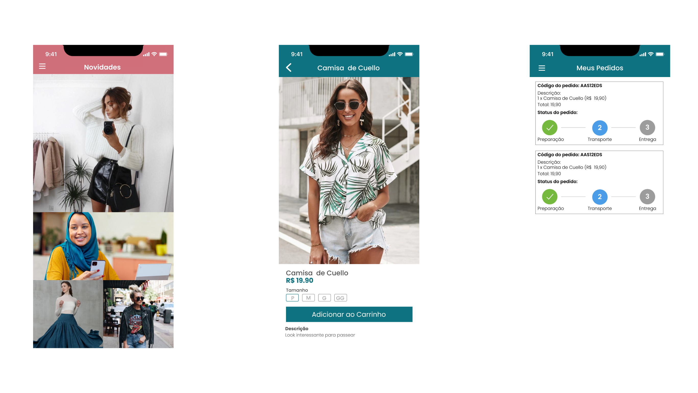

# Loja de Roupas

A new Flutter application.

  

## :rocket: Tecnologias

Esse projeto foi desenvolvido com as seguintes tecnologias:

- [Firebase](https://firebase.google.com/)
- [Flutter](https://reactjs.org)

## 🔖 Layout

Nessa opção você não precisa ter uma conta no Figma e poderá visualizar o layout diretamente pelo navegador, mas ela é limitada a 50 acessos simultâneos. Após os 50 acessos simultâneos, só é permitido acessá-lo em modo de "Apenas visualizar" o layout, e nada mais.

[Clique aqui para acessar o layout Web](https://www.figma.com/file/BGcjFzEN2zuwcYGP5Jye1T/Loja-Roupas-Flutter?node-id=0%3A1)

## Getting Started

This project is a starting point for a Flutter application.

A few resources to get you started if this is your first Flutter project:

- [Lab: Write your first Flutter app](https://flutter.dev/docs/get-started/codelab)
- [Cookbook: Useful Flutter samples](https://flutter.dev/docs/cookbook)

For help getting started with Flutter, view our
[online documentation](https://flutter.dev/docs), which offers tutorials,
samples, guidance on mobile development, and a full API reference.
